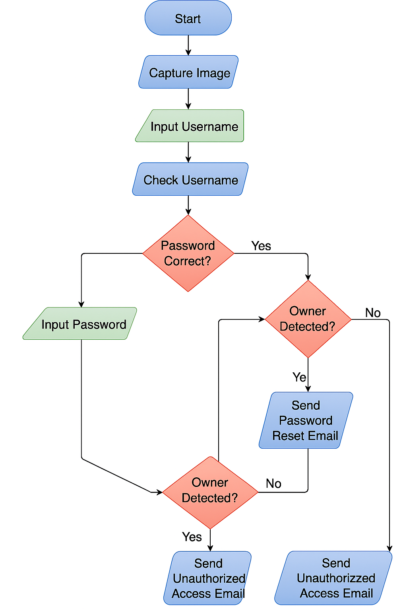

# UNAUTHORISED_ACCESS_DETECTION
This project integrates a real-time security system using webcam capture and face detection for user authentication. It sends an email alert with a password reset link for legitimate users or a warning with the captured image and location for unauthorized access.

Program Starts
The program begins execution from the main() function.

Capture Image

Webcam is activated.

An image is captured and saved in the folder captured_image/.

Face Detection

The saved image is scanned for a face using Haar cascade face detection.

Result is used to decide whether the person is the owner or an intruder.

Get Location

The system fetches the city, region, and country using the IP address via the ipinfo.io API.

Username Input

The user is prompted to enter a username.

If the username is not found in the stored user list, the program exits.

Password Attempts

The user is allowed up to 3 attempts to enter the correct password.

If the password is incorrect:

The number of attempts is counted.

On the last attempt, a warning is displayed.

Login Success Case

If the password is correct:

It checks if an intruder was detected.

If so, an email is sent with the image and location.

Otherwise, login success message is shown.

Login Failure Case

If all 3 attempts fail:

If the owner’s face is detected:

A password reset email is sent.

If no face or unauthorized face:

An alert email is sent with image, location, and attempt details.

Cleanup

Webcam is released.

Windows related to OpenCV are closed.